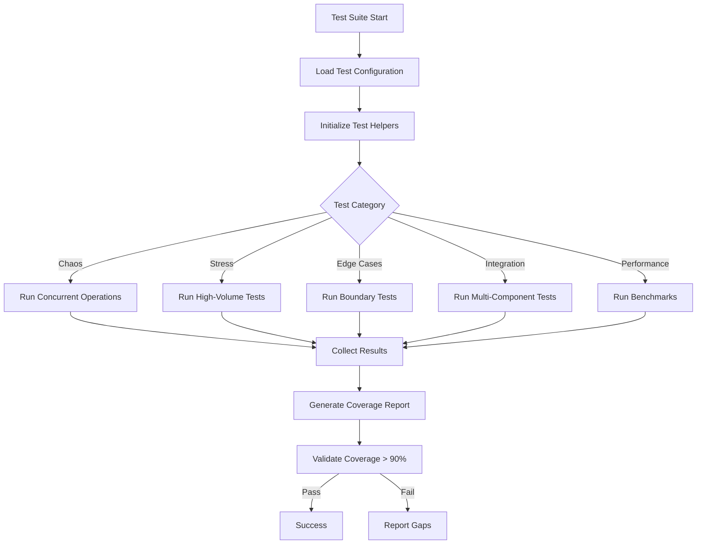

# Design Document: Advanced Medin Testing

## Overview

This design defines a comprehensive testing suite for the Medin Protocol that validates system behavior under extreme conditions, edge cases, and complex integration scenarios. The testing suite uses Vitest as the test runner and fast-check for property-based testing to validate universal correctness properties across a wide range of generated inputs.

The testing suite is organized into five major categories:
1. **Chaos Testing**: Concurrent operations, race conditions, resource exhaustion
2. **Stress Testing**: High-volume operations, large data sets, memory pressure
3. **Edge Case Testing**: Malformed inputs, boundary conditions, error cascades
4. **Integration Complexity**: Multi-component workflows, failure recovery chains
5. **Performance Under Load**: Benchmarking, performance baselines, regression detection

## Architecture

### Testing Structure

```
tests/
├── chaos/
│   ├── concurrent-validation.test.ts
│   ├── race-conditions.test.ts
│   ├── resource-exhaustion.test.ts
│   └── concurrent-spec-modifications.test.ts
├── stress/
│   ├── high-volume-validation.test.ts
│   ├── large-log-files.test.ts
│   ├── memory-pressure.test.ts
│   └── deep-nesting.test.ts
├── edge-cases/
│   ├── malformed-inputs.test.ts
│   ├── circular-dependencies.test.ts
│   ├── invalid-references.test.ts
│   └── boundary-conditions.test.ts
├── integration/
│   ├── ralph-loop-recovery.test.ts
│   ├── dependency-chains.test.ts
│   ├── workflow-rollback.test.ts
│   └── checkpoint-integration.test.ts
├── performance/
│   ├── concurrent-benchmarks.test.ts
│   ├── parsing-benchmarks.test.ts
│   ├── property-test-benchmarks.test.ts
│   └── resource-monitoring.test.ts
└── helpers/
    ├── generators.ts          # fast-check generators
    ├── fixtures.ts            # Test data fixtures
    ├── performance-utils.ts   # Performance measurement utilities
    └── chaos-utils.ts         # Chaos testing utilities
```

### Test Execution Flow



## Components and Interfaces

### 1. Test Generators (fast-check)

**Purpose**: Generate random test data for property-based tests

**Interface**:
```typescript
// tests/helpers/generators.ts

import * as fc from 'fast-check';

// Generate valid spec files
export const specFileArbitrary = fc.record({
  requirements: fc.array(requirementArbitrary, { minLength: 1, maxLength: 20 }),
  design: designArbitrary,
  tasks: fc.array(taskArbitrary, { minLength: 1, maxLength: 50 })
});

// Generate malformed spec files
export const malformedSpecArbitrary = fc.oneof(
  fc.constant(''), // Empty file
  fc.constant('   \n\t  '), // Whitespace only
  fc.string().filter(s => !isValidJSON(s) && !isValidYAML(s)), // Invalid syntax
  fc.record({ requirements: fc.constant(null) }) // Missing required fields
);

// Generate file paths with edge cases
export const edgeCasePathArbitrary = fc.oneof(
  fc.constant(''), // Empty path
  fc.constant('/'.repeat(1000)), // Very long path
  fc.constant('../../etc/passwd'), // Path traversal
  fc.string().map(s => s.replace(/[a-zA-Z0-9]/g, '!@#$%')) // Special chars only
);

// Generate concurrent operation scenarios
export const concurrentOperationArbitrary = fc.record({
  operationCount: fc.integer({ min: 2, max: 100 }),
  operations: fc.array(
    fc.oneof(
      fc.constant('read'),
      fc.constant('write'),
      fc.constant('validate'),
      fc.constant('delete')
    ),
    { minLength: 2, maxLength: 100 }
  ),
  targetFile: fc.string()
});

// Generate large data sets for stress testing
export const largeDataSetArbitrary = fc.record({
  specCount: fc.integer({ min: 100, max: 1000 }),
  logSizeBytes: fc.integer({ min: 1024 * 1024, max: 10 * 1024 * 1024 }), // 1MB - 10MB
  nestingDepth: fc.integer({ min: 10, max: 100 })
});
```

### 2. Chaos Testing Utilities

**Purpose**: Introduce controlled chaos for testing resilience

**Interface**:
```typescript
// tests/helpers/chaos-utils.ts

export class ChaosEngine {
  // Execute operations concurrently with controlled timing
  async executeConcurrently<T>(
    operations: Array<() => Promise<T>>,
    options?: {
      maxConcurrency?: number;
      delayBetweenMs?: number;
      failureRate?: number; // 0-1, probability of injected failure
    }
  ): Promise<Array<T | Error>>;

  // Simulate resource exhaustion
  async exhaustResource(
    resourceType: 'memory' | 'fileHandles' | 'cpu',
    durationMs: number
  ): Promise<void>;

  // Inject random delays to expose race conditions
  async withRandomDelays<T>(
    operation: () => Promise<T>,
    minDelayMs: number,
    maxDelayMs: number
  ): Promise<T>;

  // Simulate file system failures
  async withFileSystemChaos<T>(
    operation: () => Promise<T>,
    failureTypes: Array<'ENOENT' | 'EACCES' | 'EMFILE' | 'ENOSPC'>
  ): Promise<T>;
}
```

### 3. Performance Monitoring Utilities

**Purpose**: Measure and track performance metrics

**Interface**:
```typescript
// tests/helpers/performance-utils.ts

export class PerformanceMonitor {
  // Measure execution time
  async measureTime<T>(
    operation: () => Promise<T>,
    label: string
  ): Promise<{ result: T; durationMs: number }>;

  // Monitor memory usage during operation
  async monitorMemory<T>(
    operation: () => Promise<T>
  ): Promise<{
    result: T;
    peakMemoryMB: number;
    memoryLeakDetected: boolean;
  }>;

  // Track CPU usage
  async monitorCPU<T>(
    operation: () => Promise<T>
  ): Promise<{
    result: T;
    avgCpuPercent: number;
    peakCpuPercent: number;
  }>;

  // Establish performance baseline
  async establishBaseline(
    operation: () => Promise<void>,
    iterations: number
  ): Promise<PerformanceBaseline>;

  // Compare against baseline
  detectRegression(
    current: PerformanceMetrics,
    baseline: PerformanceBaseline
  ): RegressionReport;
}

interface PerformanceBaseline {
  avgDurationMs: number;
  stdDeviation: number;
  p95DurationMs: number;
  avgMemoryMB: number;
}

interface RegressionReport {
  hasRegression: boolean;
  durationRegressionPercent?: number;
  memoryRegressionPercent?: number;
  details: string;
}
```

### 4. Test Fixtures

**Purpose**: Provide reusable test data

**Interface**:
```typescript
// tests/helpers/fixtures.ts

export const fixtures = {
  // Valid spec files
  validSpecs: {
    minimal: { /* minimal valid spec */ },
    complex: { /* complex spec with many requirements */ },
    withDependencies: { /* spec with dependency chain */ }
  },

  // Invalid spec files
  invalidSpecs: {
    emptyFile: '',
    invalidJSON: '{invalid json}',
    circularDeps: { /* circular dependency structure */ },
    missingReferences: { /* references to non-existent requirements */ }
  },

  // Large data sets
  largeDataSets: {
    thousandSpecs: Array<SpecFile>,
    tenMBLogFile: string,
    deeplyNestedSpec: SpecFile
  },

  // Error scenarios
  errorScenarios: {
    fileNotFound: { path: '/nonexistent/file.md', error: 'ENOENT' },
    permissionDenied: { path: '/protected/file.md', error: 'EACCES' },
    diskFull: { path: '/tmp/file.md', error: 'ENOSPC' }
  }
};
```

## Data Models

### Test Configuration

```typescript
interface TestConfig {
  chaos: {
    maxConcurrency: number;
    resourceExhaustionDurationMs: number;
    failureInjectionRate: number;
  };
  stress: {
    maxSpecCount: number;
    maxLogSizeMB: number;
    maxNestingDepth: number;
    memoryThresholdMB: number;
  };
  performance: {
    benchmarkIterations: number;
    regressionThresholdPercent: number;
    timeoutMs: number;
  };
  propertyTests: {
    minIterations: number;
    maxIterations: number;
    seed?: number; // For reproducibility
  };
}
```

### Test Result

```typescript
interface TestResult {
  category: 'chaos' | 'stress' | 'edge-case' | 'integration' | 'performance';
  testName: string;
  status: 'passed' | 'failed' | 'skipped';
  durationMs: number;
  iterations?: number; // For property tests
  failingInput?: unknown; // For property test failures
  error?: Error;
  metrics?: PerformanceMetrics;
}

interface PerformanceMetrics {
  durationMs: number;
  memoryUsageMB: number;
  cpuUsagePercent: number;
  throughput?: number; // Operations per second
}
```

### Coverage Report

```typescript
interface CoverageReport {
  overall: {
    linesCovered: number;
    linesTotal: number;
    percentCovered: number;
  };
  byFile: Map<string, FileCoverage>;
  uncoveredSections: Array<UncoveredSection>;
  meetsThreshold: boolean; // >= 90%
}

interface FileCoverage {
  path: string;
  linesCovered: number;
  linesTotal: number;
  percentCovered: number;
  uncoveredLines: number[];
}

interface UncoveredSection {
  file: string;
  startLine: number;
  endLine: number;
  reason: string;
}
```


## Correctness Properties

A property is a characteristic or behavior that should hold true across all valid executions of a system—essentially, a formal statement about what the system should do. Properties serve as the bridge between human-readable specifications and machine-verifiable correctness guarantees.

### Property 1: Concurrent Operation Safety

*For any* set of concurrent operations (read, write, validate, delete) on spec files, executing them concurrently should produce results equivalent to some sequential execution, with no data corruption or lost updates.

**Validates: Requirements 1.1, 1.2, 1.4, 1.5**

**Testing Strategy**: Generate random sets of operations, execute concurrently with random delays, verify results match a valid sequential ordering and all data remains valid.

### Property 2: Graceful Resource Exhaustion

*For any* resource type (memory, file handles, CPU) and any operation, when resource exhaustion occurs, the system should either complete successfully or fail with a descriptive error (never crash or corrupt data).

**Validates: Requirements 1.3, 2.4**

**Testing Strategy**: Simulate resource exhaustion scenarios, execute operations, verify either success or clean error with no crashes or corruption.

### Property 3: Memory Efficiency Under Load

*For any* sequence of operations, memory usage should remain bounded (not exceed 2x baseline) and no memory leaks should occur (memory returns to baseline after operations complete).

**Validates: Requirements 2.1, 2.4, 5.4**

**Testing Strategy**: Execute long sequences of operations while monitoring memory, verify peak usage stays within bounds and memory returns to baseline.

### Property 4: Large Data Handling

*For any* large or deeply nested data structure (large log files, deeply nested specs), the system should process them efficiently without crashes, stack overflows, or excessive memory usage.

**Validates: Requirements 2.2, 2.5**

**Testing Strategy**: Generate large files and deep structures, process them, verify completion without errors and memory usage stays reasonable.

### Property 5: Performance Consistency

*For any* operation type, performance should remain consistent under increasing load (sub-linear time complexity for parsing, consistent throughput for validation).

**Validates: Requirements 2.3, 5.2, 5.5**

**Testing Strategy**: Measure performance at different load levels, verify time complexity is sub-linear and throughput remains stable.

### Property 6: Invalid Input Rejection

*For any* malformed input (invalid syntax, circular dependencies, missing references, invalid configurations, malformed paths, empty files, invalid timestamps), the system should reject it with a descriptive error message.

**Validates: Requirements 3.1, 3.2, 3.3, 3.4, 3.5, 3.6, 3.7**

**Testing Strategy**: Generate various types of invalid inputs, attempt to process them, verify rejection with clear error messages.

### Property 7: Dependency Resolution Ordering

*For any* set of spec files with dependency relationships, the system should validate them in an order that respects dependencies (dependencies validated before dependents).

**Validates: Requirements 4.2**

**Testing Strategy**: Generate random dependency graphs, validate specs, verify validation order respects dependency relationships.

### Property 8: Retry with Exponential Backoff

*For any* failing external operation (webhook calls, API requests), the system should retry with exponentially increasing delays and log all failures.

**Validates: Requirements 4.4**

**Testing Strategy**: Simulate failing external calls, verify retry attempts occur with correct timing and all failures are logged.

### Property 9: Error Message Quality

*For any* error condition, error messages should include sufficient context (file path, line number, error type, suggested fix) to diagnose the issue.

**Validates: Requirements 7.3**

**Testing Strategy**: Trigger various error conditions, verify error messages contain required context fields.

## Error Handling

### Error Categories

1. **Validation Errors**: Invalid spec syntax, missing required fields, invalid references
   - Return descriptive error with file path, line number, and issue description
   - Do not crash or corrupt data

2. **Resource Errors**: File not found, permission denied, disk full, out of memory
   - Return error with resource type and suggested remediation
   - Clean up partial state before returning

3. **Concurrency Errors**: Race conditions, deadlocks, resource contention
   - Retry with exponential backoff
   - Log all retry attempts
   - Fail gracefully after max retries

4. **Performance Errors**: Timeout, excessive memory usage, stack overflow
   - Abort operation cleanly
   - Return error with performance metrics
   - Log for performance analysis

### Error Recovery Strategies

```typescript
// Validation errors: Return immediately with context
try {
  validateSpec(specFile);
} catch (error) {
  return {
    success: false,
    error: {
      type: 'ValidationError',
      file: specFile.path,
      line: error.line,
      message: error.message,
      suggestion: 'Check spec syntax against schema'
    }
  };
}

// Resource errors: Clean up and retry
try {
  await writeSpecFile(path, content);
} catch (error) {
  if (error.code === 'ENOSPC') {
    await cleanupTempFiles();
    throw new ResourceError('Disk full', 'Free up disk space and retry');
  }
}

// Concurrency errors: Exponential backoff
async function withRetry<T>(
  operation: () => Promise<T>,
  maxAttempts: number = 3
): Promise<T> {
  for (let attempt = 1; attempt <= maxAttempts; attempt++) {
    try {
      return await operation();
    } catch (error) {
      if (attempt === maxAttempts) throw error;
      await delay(Math.pow(2, attempt) * 1000);
    }
  }
}
```

## Testing Strategy

### Dual Testing Approach

The testing strategy employs both unit tests and property-based tests as complementary approaches:

- **Unit tests**: Verify specific examples, edge cases, and integration points
- **Property tests**: Verify universal properties across all inputs (minimum 100 iterations)

Together, these provide comprehensive coverage where unit tests catch concrete bugs and property tests verify general correctness.

### Property-Based Testing Configuration

**Library**: fast-check (TypeScript property-based testing library)

**Configuration**:
```typescript
// vitest.config.ts
export default defineConfig({
  test: {
    coverage: {
      provider: 'v8',
      reporter: ['text', 'json', 'html'],
      lines: 90,
      functions: 90,
      branches: 90,
      statements: 90
    }
  }
});

// Property test configuration
const propertyTestConfig = {
  numRuns: 100, // Minimum iterations per property
  seed: process.env.PROPERTY_TEST_SEED, // For reproducibility
  verbose: true,
  endOnFailure: false // Collect all failures
};
```

**Test Tagging**: Each property test must include a comment linking to the design property:

```typescript
// Feature: advanced-medin-testing, Property 1: Concurrent Operation Safety
test('concurrent operations maintain data integrity', async () => {
  await fc.assert(
    fc.asyncProperty(
      concurrentOperationArbitrary,
      async (scenario) => {
        const results = await executeConcurrently(scenario.operations);
        expect(results).toMatchSequentialExecution();
        expect(await validateDataIntegrity()).toBe(true);
      }
    ),
    propertyTestConfig
  );
});
```

### Test Organization

**Chaos Tests** (`tests/chaos/`):
- Unit tests: Specific concurrency scenarios (2 readers + 1 writer, etc.)
- Property tests: Random concurrent operation sequences
- Focus: Thread-safety, race conditions, resource management

**Stress Tests** (`tests/stress/`):
- Unit tests: Specific large data sets (1000 specs, 10MB log)
- Property tests: Random large data generation
- Focus: Memory leaks, performance degradation, scalability

**Edge Case Tests** (`tests/edge-cases/`):
- Unit tests: Specific malformed inputs (empty file, invalid JSON)
- Property tests: Random invalid input generation
- Focus: Input validation, error handling, boundary conditions

**Integration Tests** (`tests/integration/`):
- Unit tests: Specific workflow scenarios (Ralph-Loop correction, checkpoint pause)
- Property tests: Random workflow combinations
- Focus: Multi-component interaction, failure recovery

**Performance Tests** (`tests/performance/`):
- Unit tests: Specific benchmarks (100 concurrent ops in 10s)
- Property tests: Performance consistency across input sizes
- Focus: Benchmarking, regression detection, resource utilization

### Coverage Requirements

- **Minimum 90% coverage** across all modules
- Coverage report generated after every test run
- Uncovered sections reported with justification
- CI/CD blocks merge if coverage falls below threshold

### Test Execution

```bash
# Run all tests with coverage
npm test -- --coverage

# Run specific test category
npm test tests/chaos
npm test tests/stress
npm test tests/edge-cases
npm test tests/integration
npm test tests/performance

# Run property tests with specific seed (for reproducibility)
PROPERTY_TEST_SEED=12345 npm test

# Run performance benchmarks
npm test tests/performance -- --reporter=verbose
```

### Continuous Integration

```yaml
# .github/workflows/test.yml
name: Test Suite
on: [push, pull_request]
jobs:
  test:
    runs-on: ubuntu-latest
    steps:
      - uses: actions/checkout@v3
      - uses: actions/setup-node@v3
      - run: npm ci
      - run: npm test -- --coverage
      - name: Check coverage threshold
        run: |
          COVERAGE=$(cat coverage/coverage-summary.json | jq '.total.lines.pct')
          if (( $(echo "$COVERAGE < 90" | bc -l) )); then
            echo "Coverage $COVERAGE% is below 90% threshold"
            exit 1
          fi
      - name: Upload coverage reports
        uses: codecov/codecov-action@v3
```

## Implementation Notes

### Test Execution Order

1. **Edge case tests first**: Fast, catch obvious bugs early
2. **Unit tests**: Verify specific scenarios
3. **Property tests**: Comprehensive input coverage
4. **Integration tests**: Multi-component workflows
5. **Stress tests**: High-volume operations
6. **Chaos tests**: Concurrent operations (most complex)
7. **Performance tests last**: Establish baselines after functionality verified

### Performance Baselines

Establish baselines during initial test run:
- Average duration for common operations
- Memory usage for typical workloads
- CPU utilization patterns

Compare subsequent runs against baselines to detect regressions.

### Test Data Management

- Use fixtures for common test data
- Generate random data with fast-check for property tests
- Clean up test artifacts after each test
- Isolate tests to prevent interference

### Debugging Failed Property Tests

When a property test fails:
1. fast-check reports the failing input (counterexample)
2. Re-run test with that specific input to reproduce
3. Use `fc.sample()` to generate similar inputs for investigation
4. Fix the bug or update the property if incorrect
5. Re-run full test suite to verify fix

