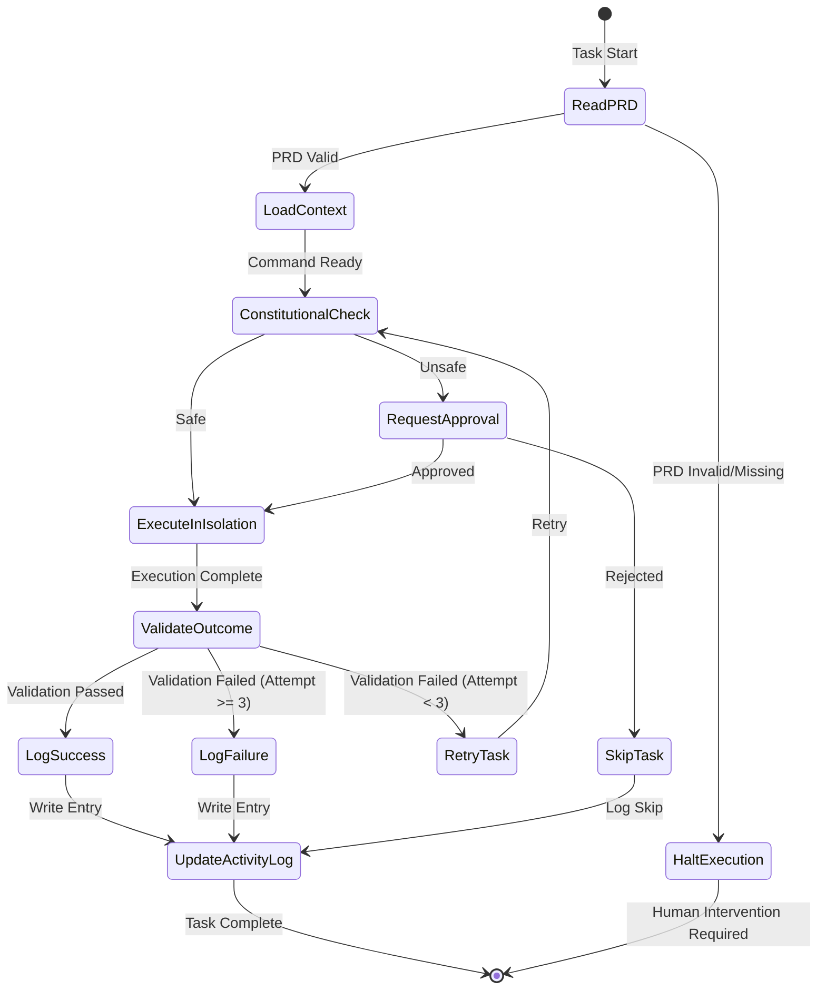

# Design Document: Medin Protocol (Ralph-Loop 2.0)

## Overview

The Medin Protocol transforms Ralph-Loop from a reactive error-correction system into a proactive, truth-grounded autonomous agent. It introduces three foundational pillars:

1. **Sovereign Memory & Truth**: PRD.md serves as the immutable source of requirements, while ACTIVITY_LOG.md provides long-term operational memory
2. **Self-Validation Layer**: Real system checks (process, network, API, filesystem) verify all task completion claims
3. **Context Isolation & Safety**: Sub-tasks execute in sandboxed environments with constitutional pre-checks for dangerous operations

This design ensures zero false positives, complete auditability, and safe autonomous operation.

## Architecture

### System Context

```
┌─────────────────────────────────────────────────────────────┐
│                    MEDIN PROTOCOL LAYER                      │
│  ┌──────────────┐  ┌──────────────┐  ┌──────────────┐     │
│  │ PRD Reader   │  │ Activity Log │  │ Validator    │     │
│  │ (Truth)      │  │ (Memory)     │  │ (Proof)      │     │
│  └──────────────┘  └──────────────┘  └──────────────┘     │
└─────────────────────────────────────────────────────────────┘
                            ↓
┌─────────────────────────────────────────────────────────────┐
│                    RALPH-LOOP ENGINE                         │
│  ┌──────────────────────────────────────────────────────┐  │
│  │ B.L.A.S.T. Protocol (Build → Log → Analyze →        │  │
│  │                      Spec → Test)                     │  │
│  └──────────────────────────────────────────────────────┘  │
│  ┌──────────────┐  ┌──────────────┐  ┌──────────────┐     │
│  │ Constitutional│  │ Isolation    │  │ MCP Tool     │     │
│  │ Pre-Check    │  │ Context      │  │ Integration  │     │
│  └──────────────┘  └──────────────┘  └──────────────┘     │
└─────────────────────────────────────────────────────────────┘
                            ↓
┌─────────────────────────────────────────────────────────────┐
│                      EXECUTION LAYER                         │
│  ┌──────────────┐  ┌──────────────┐  ┌──────────────┐     │
│  │ File System  │  │ Shell Exec   │  │ Test Runner  │     │
│  └──────────────┘  └──────────────┘  └──────────────┘     │
└─────────────────────────────────────────────────────────────┘
```

### Enhanced Ralph-Loop Flow



## Components and Interfaces

### 1. PRD Reader

**Purpose**: Load and parse master requirements from PRD.md

**Interface**:

```typescript
interface PRDReader {
  /**
   * Load PRD.md and extract requirements
   * @throws PRDNotFoundError if PRD.md doesn't exist
   * @throws PRDInvalidError if PRD.md is malformed
   */
  loadPRD(): Promise<PRDDocument>;
  
  /**
   * Extract requirements relevant to a specific task
   * @param taskId - Task identifier
   * @returns Filtered requirements
   */
  getRequirementsForTask(taskId: string): Requirement[];
  
  /**
   * Monitor PRD.md for changes
   * @param callback - Function to call when PRD changes
   */
  watchPRD(callback: (changes: PRDDiff) => void): void;
  
  /**
   * Reload PRD.md from disk
   */
  reloadPRD(): Promise<PRDDocument>;
}

interface PRDDocument {
  version: string;
  lastUpdated: Date;
  requirements: Requirement[];
  metadata: Record<string, unknown>;
}

interface Requirement {
  id: string;
  title: string;
  description: string;
  acceptanceCriteria: string[];
  priority: 'critical' | 'high' | 'medium' | 'low';
}
```

**Implementation Notes**:
- Use `fs.watch()` for file system monitoring
- Parse markdown with `remark` library
- Cache parsed PRD for 5 seconds to reduce I/O
- Validate PRD structure against JSON schema

### 2. Activity Log Manager

**Purpose**: Maintain long-term memory of all operations

**Interface**:

```typescript
interface ActivityLogManager {
  /**
   * Append entry to activity log
   * @param entry - Log entry to append
   */
  logEntry(entry: ActivityEntry): Promise<void>;
  
  /**
   * Query activity log with filters
   * @param filters - Query filters
   * @returns Matching log entries
   */
  queryLog(filters: LogFilters): Promise<ActivityEntry[]>;
  
  /**
   * Export activity log as JSON
   * @param filters - Optional filters
   * @returns JSON representation
   */
  exportJSON(filters?: LogFilters): Promise<string>;
  
  /**
   * Archive old log entries
   * @param beforeDate - Archive entries before this date
   */
  archiveOldEntries(beforeDate: Date): Promise<void>;
}

interface ActivityEntry {
  timestamp: string; // ISO 8601
  taskId: string;
  category: 'task' | 'error' | 'validation' | 'self-healing';
  status: 'success' | 'failure' | 'pending' | 'skipped';
  details: {
    description: string;
    validationResults?: ValidationResult[];
    errorContext?: ErrorContext;
    corrections?: Correction[];
  };
  metadata: Record<string, unknown>;
}

interface LogFilters {
  taskId?: string;
  category?: ActivityEntry['category'];
  status?: ActivityEntry['status'];
  since?: Date;
  until?: Date;
  limit?: number;
}
```

**Log Entry Format**:

```markdown
## [2026-01-19T15:30:00Z] Task: medin-protocol-1.1

**Category**: task  
**Status**: success  
**Task ID**: medin-protocol-1.1

### Description
Implemented PRD Reader component with file system monitoring

### Validation Results
- ✅ File exists: src/lib/prd-reader.ts
- ✅ Tests pass: 12/12
- ✅ Type check: No errors

### Metadata
- Duration: 45s
- Attempt: 1
- Validator: v1.0.0
```

### 3. Validator

**Purpose**: Perform real system checks to verify task completion

**Interface**:

```typescript
interface Validator {
  /**
   * Validate that a Docker container is running
   * @param name - Container name or ID
   * @returns Validation result with evidence
   */
  validateDockerContainer(name: string): Promise<ValidationResult>;
  
  /**
   * Validate that a network port is listening
   * @param port - Port number
   * @param host - Host address (default: localhost)
   * @returns Validation result with evidence
   */
  validateNetworkPort(port: number, host?: string): Promise<ValidationResult>;
  
  /**
   * Validate that an API endpoint responds successfully
   * @param url - API endpoint URL
   * @param expectedStatus - Expected HTTP status code (default: 200)
   * @returns Validation result with evidence
   */
  validateAPIEndpoint(url: string, expectedStatus?: number): Promise<ValidationResult>;
  
  /**
   * Validate that a file exists and is readable
   * @param path - File path
   * @returns Validation result with evidence
   */
  validateFileExists(path: string): Promise<ValidationResult>;
  
  /**
   * Execute custom validation function
   * @param validator - Custom validation function
   * @returns Validation result
   */
  validateCustom(validator: () => Promise<boolean>): Promise<ValidationResult>;
}

interface ValidationResult {
  passed: boolean;
  evidence: string;
  confidence: number; // 0-100
  duration: number; // milliseconds
  timestamp: string; // ISO 8601
  error?: string;
}
```

**Implementation Strategy**:

- **Docker Validation**: Execute `docker ps --filter name=<name> --format json`
- **Network Validation**: Use Node.js `net.connect()` to test port
- **API Validation**: Use `fetch()` with 5-second timeout
- **File Validation**: Use `fs.access()` with read permission check
- **Performance**: Run validations in parallel, cache results for 5 seconds
- **Timeout**: All validations timeout after 5 seconds

### 4. Constitutional Pre-Check

**Purpose**: Analyze shell commands for safety violations before execution

**Interface**:

```typescript
interface ConstitutionalPreCheck {
  /**
   * Analyze command for safety violations
   * @param command - Shell command to analyze
   * @returns Safety analysis result
   */
  analyzeCommand(command: string): Promise<SafetyAnalysis>;
  
  /**
   * Get safer alternative for blocked command
   * @param command - Original command
   * @returns Suggested safe alternative
   */
  suggestAlternative(command: string): string;
}

interface SafetyAnalysis {
  safe: boolean;
  violations: SafetyViolation[];
  riskLevel: 'low' | 'medium' | 'high' | 'critical';
  recommendation: 'allow' | 'warn' | 'block';
  alternative?: string;
}

interface SafetyViolation {
  type: 'file_deletion' | 'db_modification' | 'credential_exposure' | 'network_exposure';
  severity: 'low' | 'medium' | 'high' | 'critical';
  description: string;
  pattern: string; // Regex pattern that matched
}
```

**Safety Rules**:

1. **File Deletion**: Block `rm -rf`, `del /f`, require confirmation for `rm`
2. **Database Modification**: Block `DROP`, `TRUNCATE`, `DELETE FROM` without WHERE clause
3. **Credential Exposure**: Block commands containing API keys, passwords, tokens
4. **Network Exposure**: Block commands that open ports to 0.0.0.0 without firewall

**Pattern Matching**:

```typescript
const SAFETY_PATTERNS = {
  fileDelection: [
    /rm\s+-rf/,
    /del\s+\/[fs]/,
    /Remove-Item\s+-Recurse\s+-Force/
  ],
  dbModification: [
    /DROP\s+(TABLE|DATABASE)/i,
    /TRUNCATE\s+TABLE/i,
    /DELETE\s+FROM\s+\w+\s*;/i // No WHERE clause
  ],
  credentialExposure: [
    /[A-Za-z0-9]{32,}/, // Potential API key
    /password\s*=\s*['"][^'"]+['"]/i,
    /token\s*=\s*['"][^'"]+['"]/i
  ],
  networkExposure: [
    /0\.0\.0\.0/,
    /--host\s+0\.0\.0\.0/
  ]
};
```

### 5. Isolation Context

**Purpose**: Execute sub-tasks in sandboxed environments

**Interface**:

```typescript
interface IsolationContext {
  /**
   * Create isolated execution context
   * @param config - Isolation configuration
   * @returns Context handle
   */
  createContext(config: IsolationConfig): Promise<ContextHandle>;
  
  /**
   * Execute function in isolated context
   * @param handle - Context handle
   * @param fn - Function to execute
   * @returns Execution result
   */
  execute<T>(handle: ContextHandle, fn: () => Promise<T>): Promise<ExecutionResult<T>>;
  
  /**
   * Destroy isolation context
   * @param handle - Context handle
   */
  destroyContext(handle: ContextHandle): Promise<void>;
}

interface IsolationConfig {
  maxCPU: number; // Percentage (0-100)
  maxMemory: number; // Bytes
  maxTime: number; // Milliseconds
  allowedPaths: string[]; // File system access
  allowedNetworks: string[]; // Network access
}

interface ExecutionResult<T> {
  success: boolean;
  result?: T;
  error?: Error;
  stdout: string;
  stderr: string;
  exitCode: number;
  resourceUsage: {
    cpu: number;
    memory: number;
    time: number;
  };
}

type ContextHandle = string; // Unique identifier
```

**Implementation Strategy**:

- Use Node.js `child_process.fork()` for process isolation
- Use `process.setrlimit()` for resource limits (CPU, memory)
- Use `setTimeout()` for time limits
- Capture stdout/stderr with streams
- Kill process on timeout or resource violation

### 6. MCP Tool Wrapper

**Purpose**: Wrap MCP tools with Plan-Execute-Verify cycle

**Interface**:

```typescript
interface MCPToolWrapper {
  /**
   * Execute MCP tool with Plan-Execute-Verify cycle
   * @param toolName - MCP tool name
   * @param args - Tool arguments
   * @returns Execution result with verification
   */
  executeTool(toolName: string, args: Record<string, unknown>): Promise<MCPToolResult>;
  
  /**
   * Generate execution plan for tool
   * @param toolName - MCP tool name
   * @param args - Tool arguments
   * @returns Execution plan
   */
  generatePlan(toolName: string, args: Record<string, unknown>): Promise<ExecutionPlan>;
  
  /**
   * Verify tool execution outcome
   * @param result - Tool execution result
   * @returns Verification result
   */
  verifyOutcome(result: MCPToolResult): Promise<ValidationResult>;
}

interface ExecutionPlan {
  toolName: string;
  args: Record<string, unknown>;
  steps: string[];
  expectedOutcome: string;
  validationChecks: ValidationCheck[];
  rollbackStrategy: string;
}

interface ValidationCheck {
  type: 'docker' | 'network' | 'api' | 'file' | 'custom';
  config: Record<string, unknown>;
}

interface MCPToolResult {
  success: boolean;
  output: unknown;
  plan: ExecutionPlan;
  verification: ValidationResult;
}
```

**Plan-Execute-Verify Flow**:

1. **Plan**: Generate execution plan with validation checks
2. **Approve**: Present plan for approval (automated or human)
3. **Execute**: Run MCP tool with arguments
4. **Verify**: Run validation checks from plan
5. **Rollback**: If verification fails, rollback changes

### 7. CLI Status Command

**Purpose**: Query activity log via command-line interface

**Interface**:

```typescript
interface CLIStatusCommand {
  /**
   * Display recent activity
   * @param options - Display options
   */
  showStatus(options: StatusOptions): Promise<void>;
}

interface StatusOptions {
  taskId?: string;
  failed?: boolean;
  since?: string; // ISO 8601 date
  limit?: number;
  format?: 'table' | 'json' | 'markdown';
}
```

**CLI Commands**:

```bash
# Show recent activity (last 10 entries)
ag-os status

# Show specific task
ag-os status --task medin-protocol-1.1

# Show only failed tasks
ag-os status --failed

# Show activity since date
ag-os status --since 2026-01-19

# Export as JSON
ag-os status --format json > activity.json
```

**Output Format**:

```
┌─────────────────────┬──────────────────────┬──────────┬─────────────┐
│ Timestamp           │ Task ID              │ Status   │ Duration    │
├─────────────────────┼──────────────────────┼──────────┼─────────────┤
│ 2026-01-19 15:30:00 │ medin-protocol-1.1   │ ✅ Success│ 45s         │
│ 2026-01-19 15:25:00 │ medin-protocol-1.0   │ ✅ Success│ 30s         │
│ 2026-01-19 15:20:00 │ spec-parser-2.3      │ ❌ Failed │ 120s        │
└─────────────────────┴──────────────────────┴──────────┴─────────────┘
```

## Data Models

### PRD Document Schema

```json
{
  "$schema": "http://json-schema.org/draft-07/schema#",
  "type": "object",
  "required": ["version", "lastUpdated", "requirements"],
  "properties": {
    "version": {
      "type": "string",
      "pattern": "^\\d+\\.\\d+\\.\\d+$"
    },
    "lastUpdated": {
      "type": "string",
      "format": "date-time"
    },
    "requirements": {
      "type": "array",
      "items": {
        "$ref": "#/definitions/Requirement"
      }
    },
    "metadata": {
      "type": "object"
    }
  },
  "definitions": {
    "Requirement": {
      "type": "object",
      "required": ["id", "title", "description", "acceptanceCriteria", "priority"],
      "properties": {
        "id": {
          "type": "string"
        },
        "title": {
          "type": "string"
        },
        "description": {
          "type": "string"
        },
        "acceptanceCriteria": {
          "type": "array",
          "items": {
            "type": "string"
          }
        },
        "priority": {
          "type": "string",
          "enum": ["critical", "high", "medium", "low"]
        }
      }
    }
  }
}
```

### Activity Log Entry Schema

```json
{
  "$schema": "http://json-schema.org/draft-07/schema#",
  "type": "object",
  "required": ["timestamp", "taskId", "category", "status", "details"],
  "properties": {
    "timestamp": {
      "type": "string",
      "format": "date-time"
    },
    "taskId": {
      "type": "string"
    },
    "category": {
      "type": "string",
      "enum": ["task", "error", "validation", "self-healing"]
    },
    "status": {
      "type": "string",
      "enum": ["success", "failure", "pending", "skipped"]
    },
    "details": {
      "type": "object",
      "required": ["description"],
      "properties": {
        "description": {
          "type": "string"
        },
        "validationResults": {
          "type": "array",
          "items": {
            "$ref": "#/definitions/ValidationResult"
          }
        },
        "errorContext": {
          "type": "object"
        },
        "corrections": {
          "type": "array"
        }
      }
    },
    "metadata": {
      "type": "object"
    }
  },
  "definitions": {
    "ValidationResult": {
      "type": "object",
      "required": ["passed", "evidence", "confidence", "duration", "timestamp"],
      "properties": {
        "passed": {
          "type": "boolean"
        },
        "evidence": {
          "type": "string"
        },
        "confidence": {
          "type": "number",
          "minimum": 0,
          "maximum": 100
        },
        "duration": {
          "type": "number"
        },
        "timestamp": {
          "type": "string",
          "format": "date-time"
        },
        "error": {
          "type": "string"
        }
      }
    }
  }
}
```


## Correctness Properties

*A property is a characteristic or behavior that should hold true across all valid executions of a system—essentially, a formal statement about what the system should do. Properties serve as the bridge between human-readable specifications and machine-verifiable correctness guarantees.*

### Property Reflection

After analyzing all 60 acceptance criteria, I identified several opportunities to consolidate redundant properties:

- **Validation API properties (4.1-4.4)** can be combined into a single property about validation function completeness
- **Constitutional pre-check blocking rules (5.2-5.4)** can be combined into a single property about safety rule enforcement
- **CLI filtering properties (8.2-8.4)** can be combined into a single property about filter correctness
- **Activity log structure properties (11.1-11.3)** can be combined into a single property about log format consistency

This reduces 60 criteria to 42 unique, non-redundant properties.

### Core Properties

**Property 1: PRD-First Execution Order**  
*For any* task execution, reading PRD.md must occur before any code execution, and the execution trace must show PRD reading as the first operation.  
**Validates: Requirements 1.1**

**Property 2: PRD Validation Halts Execution**  
*For any* invalid or missing PRD.md state, Ralph-Loop must halt execution and not proceed to task execution.  
**Validates: Requirements 1.2**

**Property 3: PRD Conflict Resolution**  
*For any* task with requirements that conflict with PRD.md, Ralph-Loop must prioritize PRD.md requirements and log the conflict to ACTIVITY_LOG.md.  
**Validates: Requirements 1.3**

**Property 4: Requirement Extraction Relevance**  
*For any* task and PRD combination, extracted requirements must be relevant to the task context (share keywords or dependencies).  
**Validates: Requirements 1.4**

**Property 5: PRD Reload on Update**  
*For any* PRD.md file modification during execution, Ralph-Loop must reload requirements before executing the next task.  
**Validates: Requirements 1.5**

**Property 6: Success Logging Completeness**  
*For any* successfully completed task, the ACTIVITY_LOG.md entry must contain timestamp, task ID, outcome, and validation results.  
**Validates: Requirements 2.1**

**Property 7: Failure Logging Completeness**  
*For any* failed task, the ACTIVITY_LOG.md entry must contain error context, attempted corrections, and final state.  
**Validates: Requirements 2.2**

**Property 8: Self-Healing Documentation**  
*For any* self-healing event, the ACTIVITY_LOG.md entry must document the error, analysis, spec update, and resolution.  
**Validates: Requirements 2.3**

**Property 9: Log Format Consistency**  
*For any* activity log entry, it must parse successfully as markdown with YAML frontmatter, ISO 8601 timestamps, and valid category tags.  
**Validates: Requirements 2.4, 11.1, 11.2, 11.3**

**Property 10: Zero Task Completion Without Validation**  
*For any* task, it must not be marked as complete unless validation has executed and passed.  
**Validates: Requirements 3.1, 9.1**

**Property 11: Validation Failure Triggers Retry**  
*For any* task with failed validation (attempt < 3), Ralph-Loop must retry the task or escalate to human review.  
**Validates: Requirements 3.2**

**Property 12: Validation Type Completeness**  
*For any* validation request, the Validator must support docker, network, API, and file system validation types.  
**Validates: Requirements 3.3, 4.1, 4.2, 4.3, 4.4**

**Property 13: Validation Performance Monitoring**  
*For any* validation that takes longer than 100ms, the Validator must log a performance warning.  
**Validates: Requirements 3.4, 10.2**

**Property 14: Validation Result Structure**  
*For any* validation execution, the result must contain passed (boolean), evidence (string), confidence (0-100), duration (ms), and timestamp (ISO 8601).  
**Validates: Requirements 3.5**

**Property 15: Validation Error Detail**  
*For any* failed validation, the error information must include expected state and actual state.  
**Validates: Requirements 4.5**

**Property 16: Constitutional Pre-Check Always Runs**  
*For any* shell command execution, constitutional pre-check analysis must occur before the command executes.  
**Validates: Requirements 5.1**

**Property 17: Safety Rule Enforcement**  
*For any* command matching safety violation patterns (file deletion, DB modification, credential exposure), the constitutional pre-check must block execution and suggest alternatives.  
**Validates: Requirements 5.2, 5.3, 5.4, 5.5**

**Property 18: Sub-Task Isolation**  
*For any* sub-task execution, it must run in an isolated process with limited permissions separate from the parent process.  
**Validates: Requirements 6.1**

**Property 19: Failure Containment**  
*For any* failing sub-task, the failure must not propagate to the parent process or affect other sub-tasks.  
**Validates: Requirements 6.2**

**Property 20: Resource Limit Enforcement**  
*For any* sub-task, resource limits (CPU, memory, time) must be enforced, and violations must trigger graceful termination.  
**Validates: Requirements 6.3, 6.4**

**Property 21: Sub-Task Output Capture**  
*For any* sub-task execution, stdout, stderr, and exit code must be captured completely.  
**Validates: Requirements 6.5**

**Property 22: MCP Tool Plan Generation**  
*For any* MCP tool invocation, an execution plan must be generated before any actions are taken.  
**Validates: Requirements 7.1**

**Property 23: MCP Tool Approval Required**  
*For any* generated execution plan, approval (human or automated) must be obtained before execution.  
**Validates: Requirements 7.2**

**Property 24: MCP Tool Execution After Approval**  
*For any* approved execution plan, the planned actions must execute in the specified order.  
**Validates: Requirements 7.3**

**Property 25: MCP Tool Post-Execution Verification**  
*For any* completed MCP tool action, verification using the Validator must occur.  
**Validates: Requirements 7.4**

**Property 26: MCP Tool Rollback on Failure**  
*For any* MCP tool verification failure, changes must be rolled back and failure must be reported.  
**Validates: Requirements 7.5**

**Property 27: CLI Filter Correctness**  
*For any* CLI status query with filters (task ID, status, date range), the returned entries must match all specified filter criteria.  
**Validates: Requirements 8.2, 8.3, 8.4, 11.5**

**Property 28: CLI Color Coding**  
*For any* CLI status output, success entries must be green, failure entries must be red, and warning entries must be yellow.  
**Validates: Requirements 8.5**

**Property 29: Validation Unavailable Handling**  
*For any* task where validation is unavailable (network down, service unreachable), the task must be marked as "pending verification" not "complete".  
**Validates: Requirements 9.2**

**Property 30: False Positive Rate Monitoring**  
*For any* execution period, if false positive rate exceeds 0.1%, an alert must be triggered.  
**Validates: Requirements 9.3**

**Property 31: Retroactive False Positive Correction**  
*For any* retroactively detected false positive, the task status must be updated and logged to ACTIVITY_LOG.md.  
**Validates: Requirements 9.4**

**Property 32: Validation Bypass Requires Justification**  
*For any* validation bypass attempt, a manual override with written justification must be required.  
**Validates: Requirements 9.5**

**Property 33: Validation Performance (95th Percentile)**  
*For any* set of 100 validation executions, at least 95 must complete in under 100ms.  
**Validates: Requirements 10.1**

**Property 34: Validation Result Caching**  
*For any* duplicate validation request within 5 seconds, the cached result must be returned without re-execution.  
**Validates: Requirements 10.3**

**Property 35: Validation Parallel Execution**  
*For any* set of independent validation checks, they must execute in parallel when possible.  
**Validates: Requirements 10.4**

**Property 36: Validation Timeout Enforcement**  
*For any* validation execution, it must timeout after 5 seconds and return a timeout error.  
**Validates: Requirements 10.5**

**Property 37: Activity Log JSON Export**  
*For any* activity log, the JSON export must be valid JSON and preserve all log entry data.  
**Validates: Requirements 11.4**

**Property 38: PRD File System Monitoring**  
*For any* PRD.md file modification during task execution, the modification must be detected within 1 second.  
**Validates: Requirements 12.1**

**Property 39: PRD Reload Triggers Pause**  
*For any* detected PRD.md modification, execution must pause and requirements must reload before continuing.  
**Validates: Requirements 12.2**

**Property 40: PRD Conflict Requires Human Decision**  
*For any* reloaded PRD with requirements that conflict with in-progress tasks, human decision must be requested.  
**Validates: Requirements 12.3**

**Property 41: PRD Reload Logging**  
*For any* PRD reload event, an entry must be logged to ACTIVITY_LOG.md with a diff summary.  
**Validates: Requirements 12.4**

**Property 42: PRD Freeze Mode**  
*For any* execution with freeze mode enabled, PRD.md modifications must be ignored until freeze mode is disabled.  
**Validates: Requirements 12.5**

## Error Handling

### Error Categories

1. **PRD Errors**
   - Missing PRD.md → Halt execution, request human intervention
   - Invalid PRD format → Halt execution, show validation errors
   - PRD conflict → Log conflict, prioritize PRD, continue

2. **Validation Errors**
   - Validation timeout → Mark as "pending verification", retry later
   - Validation unavailable → Mark as "pending verification", alert operator
   - Validation failed → Retry task (max 3 attempts), then escalate

3. **Constitutional Errors**
   - Unsafe command → Block execution, suggest alternative, request approval
   - Pattern match failure → Log warning, allow execution with confirmation

4. **Isolation Errors**
   - Resource limit exceeded → Terminate sub-task, log violation
   - Process creation failed → Retry once, then fail task
   - Output capture failed → Log warning, continue with partial output

5. **Activity Log Errors**
   - Log write failed → Retry 3 times, then alert operator
   - Log size exceeded → Archive old entries, create new log
   - Log parse failed → Log error, continue execution

### Error Recovery Strategies

**B.L.A.S.T. Protocol Integration**:

1. **Build**: Execute task with validation
2. **Log**: Capture error to ACTIVITY_LOG.md
3. **Analyze**: Check against PRD and memory graph
4. **Spec**: Update PRD if error due to missing requirements
5. **Test**: Re-run with validation until green (max 3 attempts)

**Escalation Path**:

```
Validation Failed (Attempt 1)
  ↓
Retry with B.L.A.S.T. correction
  ↓
Validation Failed (Attempt 2)
  ↓
Retry with alternative approach
  ↓
Validation Failed (Attempt 3)
  ↓
Mark as "pending human review"
  ↓
Log to ACTIVITY_LOG.md with full context
  ↓
Alert operator via CLI
```

## Testing Strategy

### Dual Testing Approach

This feature requires both **unit tests** and **property-based tests** for comprehensive coverage:

- **Unit tests**: Verify specific examples, edge cases, and error conditions
- **Property tests**: Verify universal properties across all inputs
- Together: Comprehensive coverage (unit tests catch concrete bugs, property tests verify general correctness)

### Property-Based Testing Configuration

**Library**: fast-check (TypeScript property-based testing library)

**Configuration**:
- Minimum 100 iterations per property test
- Each test tagged with design property reference
- Tag format: `Feature: medin-protocol, Property {number}: {property_text}`

**Example Property Test**:

```typescript
import fc from 'fast-check';
import { describe, it } from 'vitest';
import { RalphLoop } from '@/lib/ralph-loop';

describe('Medin Protocol - Property Tests', () => {
  it('Property 10: Zero Task Completion Without Validation', async () => {
    // Feature: medin-protocol, Property 10: Zero Task Completion Without Validation
    await fc.assert(
      fc.asyncProperty(
        fc.record({
          taskId: fc.string(),
          code: fc.string(),
          shouldValidationPass: fc.boolean()
        }),
        async ({ taskId, code, shouldValidationPass }) => {
          const ralphLoop = new RalphLoop();
          const result = await ralphLoop.executeTask(taskId, code);
          
          // Property: Task cannot be complete without validation passing
          if (result.status === 'complete') {
            expect(result.validationPassed).toBe(true);
          }
        }
      ),
      { numRuns: 100 }
    );
  });
  
  it('Property 33: Validation Performance (95th Percentile)', async () => {
    // Feature: medin-protocol, Property 33: Validation Performance (95th Percentile)
    const durations: number[] = [];
    
    for (let i = 0; i < 100; i++) {
      const start = Date.now();
      await validator.validateFileExists('/tmp/test.txt');
      const duration = Date.now() - start;
      durations.push(duration);
    }
    
    durations.sort((a, b) => a - b);
    const p95 = durations[94]; // 95th percentile
    
    expect(p95).toBeLessThan(100);
  });
});
```

### Unit Testing Focus Areas

1. **PRD Reader**
   - Valid PRD parsing
   - Invalid PRD error handling
   - File system monitoring
   - Requirement extraction

2. **Activity Log Manager**
   - Log entry formatting
   - Log archival at 10MB
   - JSON export
   - Filter queries

3. **Validator**
   - Docker container validation
   - Network port validation
   - API endpoint validation
   - File existence validation
   - Timeout handling
   - Caching behavior

4. **Constitutional Pre-Check**
   - Pattern matching for each safety rule
   - Alternative suggestion generation
   - Approval request flow

5. **Isolation Context**
   - Process creation
   - Resource limit enforcement
   - Output capture
   - Graceful termination

6. **MCP Tool Wrapper**
   - Plan generation
   - Approval flow
   - Execution order
   - Verification
   - Rollback

7. **CLI Status Command**
   - Log parsing
   - Filter application
   - Color coding
   - Output formatting

### Integration Testing

**End-to-End Scenarios**:

1. **Happy Path**: Task execution with PRD, validation, and logging
2. **Validation Failure**: Task retry and escalation
3. **PRD Update**: Mid-execution PRD reload
4. **Unsafe Command**: Constitutional pre-check blocking
5. **Resource Violation**: Sub-task termination
6. **MCP Tool Failure**: Rollback and error reporting

### Performance Testing

**Benchmarks**:

- Validation latency: <100ms (95th percentile)
- PRD reload time: <50ms
- Activity log write: <10ms
- Constitutional pre-check: <5ms

**Load Testing**:

- 1000 concurrent validations
- 100 PRD reloads per minute
- 10,000 activity log entries

### Test Coverage Requirements

- Minimum 80% code coverage
- 100% coverage for validation logic
- 100% coverage for constitutional pre-check patterns
- All 42 properties implemented as property tests

