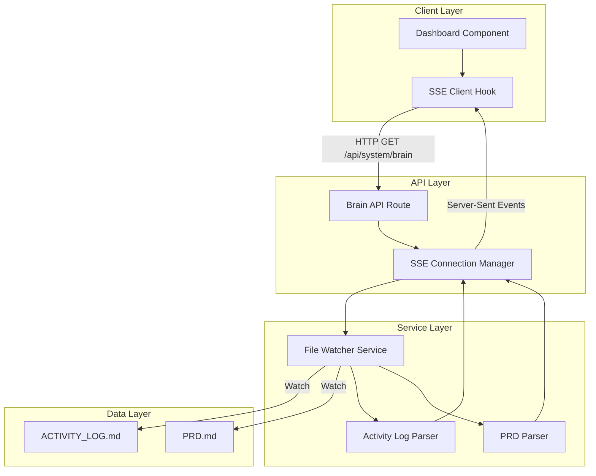

# Design Document: Ralph's Brain View

## Overview

Ralph's Brain View is a real-time visualization dashboard that provides transparency into autonomous agent decision-making. The system consists of three main components: a Server-Sent Events (SSE) API for streaming activity data, a React dashboard component for visualization, and a file-watching service for detecting changes to ACTIVITY_LOG.md and PRD.md.

The design follows a reactive architecture where file system changes trigger updates that flow through the SSE connection to connected clients. The dashboard uses modern web technologies (Next.js 14, React Server Components, Tailwind CSS) to create a command center aesthetic with glassmorphism and neon accents.

**Key Design Decisions:**
- **SSE over WebSockets**: Simpler implementation, automatic reconnection, HTTP/2 multiplexing
- **File-based state**: Leverages existing ACTIVITY_LOG.md and PRD.md as single source of truth
- **React Server Components**: Reduces client-side JavaScript, improves initial load performance
- **Tailwind CSS**: Rapid styling with consistent design tokens

## Architecture

### System Components



### Data Flow

1. **Initial Connection**: Client requests `/api/system/brain`, receives current state
2. **File Change Detection**: File watcher detects changes to ACTIVITY_LOG.md or PRD.md
3. **Parsing**: Appropriate parser extracts structured data from markdown
4. **Broadcasting**: SSE manager pushes updates to all connected clients
5. **Rendering**: Dashboard component updates UI with new data

### Technology Stack

- **Frontend**: Next.js 14, React 18, TypeScript, Tailwind CSS
- **Backend**: Next.js API Routes, Node.js fs.watch
- **Styling**: Tailwind CSS, Framer Motion (animations)
- **Fonts**: JetBrains Mono (terminal aesthetic)
- **State Management**: React hooks (useState, useEffect, useReducer)

## Components and Interfaces

### 1. Brain API Route (`/api/system/brain`)

**Endpoint**: `GET /api/system/brain`

**Response Type**: `text/event-stream`

**Event Format**:
```typescript
interface BrainEvent {
  type: 'activity' | 'prd_update' | 'correction' | 'heartbeat';
  timestamp: string;
  data: ActivityEntry | PRDStatus | CorrectionEvent;
}

interface ActivityEntry {
  id: string;
  timestamp: string;
  message: string;
  level: 'info' | 'success' | 'error' | 'correction';
}

interface PRDStatus {
  totalTasks: number;
  completedTasks: number;
  inProgressTasks: number;
  completionPercentage: number;
  tasks: Task[];
}

interface Task {
  id: string;
  description: string;
  status: 'not_started' | 'in_progress' | 'completed';
  priority: number;
  dependencies: string[];
}

interface CorrectionEvent {
  taskId: string;
  errorMessage: string;
  blastStep: 'build' | 'log' | 'analyze' | 'spec' | 'test';
  attemptNumber: number;
}
```

**Implementation**:
```typescript
// src/app/api/system/brain/route.ts
export async function GET(request: Request) {
  const encoder = new TextEncoder();
  const stream = new ReadableStream({
    async start(controller) {
      // Send initial state
      const initialState = await getBrainState();
      controller.enqueue(encoder.encode(`data: ${JSON.stringify(initialState)}\n\n`));
      
      // Set up file watchers
      const watcher = new FileWatcherService();
      watcher.on('activity', (entry) => {
        controller.enqueue(encoder.encode(`data: ${JSON.stringify(entry)}\n\n`));
      });
      
      // Heartbeat every 30 seconds
      const heartbeat = setInterval(() => {
        controller.enqueue(encoder.encode(`: heartbeat\n\n`));
      }, 30000);
      
      // Cleanup on disconnect
      request.signal.addEventListener('abort', () => {
        clearInterval(heartbeat);
        watcher.close();
        controller.close();
      });
    }
  });
  
  return new Response(stream, {
    headers: {
      'Content-Type': 'text/event-stream',
      'Cache-Control': 'no-cache',
      'Connection': 'keep-alive',
    },
  });
}
```

### 2. File Watcher Service

**Purpose**: Monitor ACTIVITY_LOG.md and PRD.md for changes

**Implementation**:
```typescript
// src/lib/services/file-watcher.ts
import { watch } from 'fs';
import { EventEmitter } from 'events';

export class FileWatcherService extends EventEmitter {
  private watchers: Map<string, FSWatcher> = new Map();
  
  constructor() {
    super();
    this.watchFile('ACTIVITY_LOG.md', 'activity');
    this.watchFile('PRD.md', 'prd');
  }
  
  private watchFile(filename: string, eventType: string): void {
    const watcher = watch(filename, async (eventType, filename) => {
      if (eventType === 'change') {
        const data = await this.parseFile(filename);
        this.emit(eventType, data);
      }
    });
    this.watchers.set(filename, watcher);
  }
  
  private async parseFile(filename: string): Promise<any> {
    if (filename === 'ACTIVITY_LOG.md') {
      return ActivityLogParser.parse(filename);
    } else if (filename === 'PRD.md') {
      return PRDParser.parse(filename);
    }
  }
  
  close(): void {
    this.watchers.forEach(watcher => watcher.close());
    this.watchers.clear();
  }
}
```

### 3. Activity Log Parser

**Purpose**: Extract structured data from ACTIVITY_LOG.md

**Input Format** (ACTIVITY_LOG.md):
```markdown
## 2026-01-19 15:30:00 - Task Started
- Task: 3.1 Create atomic file writer
- Status: in_progress

## 2026-01-19 15:32:15 - Self-Correction Event
- Error: Type mismatch in file writer
- B.L.A.S.T. Step: Analyze
- Attempt: 1
```

**Implementation**:
```typescript
// src/lib/parsers/activity-log-parser.ts
export class ActivityLogParser {
  static async parse(filepath: string): Promise<ActivityEntry[]> {
    const content = await fs.readFile(filepath, 'utf-8');
    const entries: ActivityEntry[] = [];
    
    // Regex to match markdown headers with timestamps
    const headerRegex = /## (\d{4}-\d{2}-\d{2} \d{2}:\d{2}:\d{2}) - (.+)/g;
    const matches = content.matchAll(headerRegex);
    
    for (const match of matches) {
      const [_, timestamp, message] = match;
      const level = this.detectLevel(message);
      
      entries.push({
        id: crypto.randomUUID(),
        timestamp,
        message,
        level,
      });
    }
    
    // Return latest 10 entries
    return entries.slice(-10);
  }
  
  private static detectLevel(message: string): ActivityEntry['level'] {
    if (message.includes('Self-Correction')) return 'correction';
    if (message.includes('Error') || message.includes('Failed')) return 'error';
    if (message.includes('Completed') || message.includes('Success')) return 'success';
    return 'info';
  }
}
```

### 4. PRD Parser

**Purpose**: Extract task status and calculate completion percentage

**Input Format** (PRD.md):
```markdown
# Implementation Plan

## Tasks

- [x] 1. Setup project structure
- [ ] 2. Implement core logic
  - [x] 2.1 Create data models
  - [ ] 2.2 Write tests
- [ ] 3. Integration
```

**Implementation**:
```typescript
// src/lib/parsers/prd-parser.ts
export class PRDParser {
  static async parse(filepath: string): Promise<PRDStatus> {
    const content = await fs.readFile(filepath, 'utf-8');
    const tasks: Task[] = [];
    
    // Regex to match checkbox tasks (only top-level, not sub-tasks)
    const taskRegex = /^- \[([ x])\] (\d+)\. (.+)$/gm;
    const matches = content.matchAll(taskRegex);
    
    for (const match of matches) {
      const [_, checked, id, description] = match;
      const status = checked === 'x' ? 'completed' : 'not_started';
      
      tasks.push({
        id,
        description,
        status,
        priority: 0,
        dependencies: this.extractDependencies(description),
      });
    }
    
    const completedTasks = tasks.filter(t => t.status === 'completed').length;
    const totalTasks = tasks.length;
    const completionPercentage = totalTasks > 0 
      ? Math.round((completedTasks / totalTasks) * 100) 
      : 0;
    
    return {
      totalTasks,
      completedTasks,
      inProgressTasks: 0, // Detected from ACTIVITY_LOG.md
      completionPercentage,
      tasks,
    };
  }
  
  private static extractDependencies(description: string): string[] {
    // Extract task IDs mentioned in description (e.g., "depends on 2.1")
    const depRegex = /depends on ([\d.]+)/gi;
    const matches = description.matchAll(depRegex);
    return Array.from(matches, m => m[1]);
  }
}
```

### 5. Dashboard Component

**Purpose**: Visualize brain activity with command center aesthetic

**Component Structure**:
```typescript
// src/components/dashboard/ralphs-brain-view.tsx
'use client';

import { useEffect, useState } from 'react';
import { useBrainStream } from '@/hooks/use-brain-stream';
import { ThinkingStream } from './thinking-stream';
import { ProgressBar } from './progress-bar';
import { NeonIndicator } from './neon-indicator';
import { CorrectionOverlay } from './correction-overlay';
import { TaskList } from './task-list';

export function RalphsBrainView() {
  const { activities, prdStatus, correction, isConnected } = useBrainStream();
  
  return (
    <div className="relative w-full h-full bg-slate-900/50 backdrop-blur-xl rounded-2xl border border-slate-700/50 shadow-2xl overflow-hidden">
      {/* Header */}
      <div className="flex items-center justify-between p-6 border-b border-slate-700/50">
        <h2 className="text-2xl font-bold text-white font-mono">
          Ralph's Live Brain
        </h2>
        <NeonIndicator 
          status={correction ? 'error' : isConnected ? 'thinking' : 'idle'} 
        />
      </div>
      
      {/* Main Content */}
      <div className="grid grid-cols-1 lg:grid-cols-2 gap-6 p-6">
        {/* Thinking Stream */}
        <div className="space-y-4">
          <h3 className="text-lg font-semibold text-slate-300">
            Thinking Process
          </h3>
          <ThinkingStream activities={activities} />
        </div>
        
        {/* Task Progress */}
        <div className="space-y-4">
          <h3 className="text-lg font-semibold text-slate-300">
            PRD Progress
          </h3>
          <ProgressBar 
            percentage={prdStatus?.completionPercentage ?? 0}
            completed={prdStatus?.completedTasks ?? 0}
            total={prdStatus?.totalTasks ?? 0}
          />
          <TaskList 
            tasks={prdStatus?.tasks ?? []}
            onTaskClick={handleTaskPrioritize}
          />
        </div>
      </div>
      
      {/* Correction Overlay */}
      {correction && (
        <CorrectionOverlay 
          correction={correction}
          onClose={() => {/* handled by auto-dismiss */}}
        />
      )}
    </div>
  );
}
```

### 6. SSE Client Hook

**Purpose**: Manage SSE connection and state updates

**Implementation**:
```typescript
// src/hooks/use-brain-stream.ts
import { useEffect, useState, useReducer } from 'react';

interface BrainState {
  activities: ActivityEntry[];
  prdStatus: PRDStatus | null;
  correction: CorrectionEvent | null;
  isConnected: boolean;
}

type BrainAction = 
  | { type: 'ACTIVITY_ADDED'; payload: ActivityEntry }
  | { type: 'PRD_UPDATED'; payload: PRDStatus }
  | { type: 'CORRECTION_STARTED'; payload: CorrectionEvent }
  | { type: 'CORRECTION_ENDED' }
  | { type: 'CONNECTED' }
  | { type: 'DISCONNECTED' };

function brainReducer(state: BrainState, action: BrainAction): BrainState {
  switch (action.type) {
    case 'ACTIVITY_ADDED':
      return {
        ...state,
        activities: [...state.activities.slice(-9), action.payload],
      };
    case 'PRD_UPDATED':
      return { ...state, prdStatus: action.payload };
    case 'CORRECTION_STARTED':
      return { ...state, correction: action.payload };
    case 'CORRECTION_ENDED':
      return { ...state, correction: null };
    case 'CONNECTED':
      return { ...state, isConnected: true };
    case 'DISCONNECTED':
      return { ...state, isConnected: false };
    default:
      return state;
  }
}

export function useBrainStream() {
  const [state, dispatch] = useReducer(brainReducer, {
    activities: [],
    prdStatus: null,
    correction: null,
    isConnected: false,
  });
  
  useEffect(() => {
    const eventSource = new EventSource('/api/system/brain');
    
    eventSource.onopen = () => {
      dispatch({ type: 'CONNECTED' });
    };
    
    eventSource.onmessage = (event) => {
      const data: BrainEvent = JSON.parse(event.data);
      
      switch (data.type) {
        case 'activity':
          dispatch({ type: 'ACTIVITY_ADDED', payload: data.data });
          break;
        case 'prd_update':
          dispatch({ type: 'PRD_UPDATED', payload: data.data });
          break;
        case 'correction':
          dispatch({ type: 'CORRECTION_STARTED', payload: data.data });
          setTimeout(() => {
            dispatch({ type: 'CORRECTION_ENDED' });
          }, 5000); // Auto-dismiss after 5 seconds
          break;
      }
    };
    
    eventSource.onerror = () => {
      dispatch({ type: 'DISCONNECTED' });
      eventSource.close();
      
      // Reconnect after 5 seconds
      setTimeout(() => {
        // Trigger re-render to create new EventSource
      }, 5000);
    };
    
    return () => {
      eventSource.close();
    };
  }, []);
  
  return state;
}
```

## Data Models

### Activity Entry
```typescript
interface ActivityEntry {
  id: string;              // UUID for React keys
  timestamp: string;       // ISO 8601 format
  message: string;         // Human-readable description
  level: 'info' | 'success' | 'error' | 'correction';
}
```

### PRD Status
```typescript
interface PRDStatus {
  totalTasks: number;
  completedTasks: number;
  inProgressTasks: number;
  completionPercentage: number;  // 0-100
  tasks: Task[];
}
```

### Task
```typescript
interface Task {
  id: string;              // Task number (e.g., "3.1")
  description: string;     // Task description
  status: 'not_started' | 'in_progress' | 'completed';
  priority: number;        // 0 = normal, 1 = high priority
  dependencies: string[];  // Array of task IDs
}
```

### Correction Event
```typescript
interface CorrectionEvent {
  taskId: string;
  errorMessage: string;
  blastStep: 'build' | 'log' | 'analyze' | 'spec' | 'test';
  attemptNumber: number;   // 1-3
}
```

### Brain Event (SSE)
```typescript
interface BrainEvent {
  type: 'activity' | 'prd_update' | 'correction' | 'heartbeat';
  timestamp: string;
  data: ActivityEntry | PRDStatus | CorrectionEvent | null;
}
```

## Correctness Properties

*A property is a characteristic or behavior that should hold true across all valid executions of a system—essentially, a formal statement about what the system should do. Properties serve as the bridge between human-readable specifications and machine-verifiable correctness guarantees.*


### Property 1: Activity Stream Completeness
*For any* ACTIVITY_LOG.md file with N entries, when the Brain_API is queried, it should return min(10, N) entries in chronological order.
**Validates: Requirements 1.1**

### Property 2: Broadcast Consistency
*For any* number of connected clients, when a new activity entry is added to ACTIVITY_LOG.md, all connected clients should receive the same update event.
**Validates: Requirements 1.5**

### Property 3: Resource Cleanup
*For any* SSE connection, when the client disconnects, all associated resources (file watchers, event listeners, timers) should be released and no memory leaks should occur.
**Validates: Requirements 1.4**

### Property 4: PRD Parsing Correctness
*For any* valid PRD.md file, parsing should extract all top-level tasks with correct task ID, description, status, and dependencies, and calculate completion percentage as (completed_tasks / total_tasks) * 100.
**Validates: Requirements 2.1, 2.4, 2.5**

### Property 5: Graceful Error Handling
*For any* invalid or malformed input (missing files, invalid syntax, parsing errors), the system should return a structured error response, maintain previous valid state, and continue operating without crashing.
**Validates: Requirements 2.3, 8.1, 8.2, 8.4, 8.5**

### Property 6: State-to-Visual Mapping
*For any* agent state (thinking, success, error, correction), the dashboard should display the corresponding neon indicator color (cyan, emerald, rose) and appropriate UI elements (overlays, animations, badges).
**Validates: Requirements 3.4, 4.1, 4.2, 4.5**

### Property 7: Auto-Scroll Behavior
*For any* sequence of activity entries, when new entries are added to the thinking stream, the scroll position should automatically move to show the latest entry.
**Validates: Requirements 3.2**

### Property 8: Task Prioritization Lifecycle
*For any* task, when a user clicks it, the task should be marked as high-priority with visual feedback, and when the task begins execution, the priority flag should be cleared.
**Validates: Requirements 5.1, 5.2, 5.3**

### Property 9: Dependency Visualization
*For any* task with dependencies, the UI should display visual indicators (disabled state, tooltip, or icon) showing which tasks must be completed first.
**Validates: Requirements 5.4, 5.5**

### Property 10: Memory Bounds
*For any* activity log size, the system should never store more than 100 entries in memory, implementing a sliding window that retains only the most recent entries.
**Validates: Requirements 7.1**

### Property 11: Reconnection with Backoff
*For any* SSE connection failure, the client should attempt reconnection with exponential backoff (delays: 1s, 2s, 4s, 8s, ...) up to a maximum delay of 60 seconds.
**Validates: Requirements 8.3**

### Property 12: Keyboard Navigation Completeness
*For any* interactive element in the dashboard (tasks, buttons, controls), pressing Tab should move focus to that element in a logical order, and pressing Enter/Space should activate it.
**Validates: Requirements 9.2**

### Property 13: Accessible Indicators
*For any* color-coded indicator, there should be an accompanying text label, icon, or ARIA attribute that conveys the same information without relying on color alone.
**Validates: Requirements 9.1, 9.3**

### Property 14: Motion Preference Respect
*For any* animation in the dashboard, when the user's system has prefers-reduced-motion enabled, the animation should be disabled or replaced with an instant transition.
**Validates: Requirements 9.4**

### Property 15: Contrast Compliance
*For any* text element in the dashboard, the contrast ratio between text color and background color should be at least 4.5:1 for normal text and 3:1 for large text.
**Validates: Requirements 9.5**

### Property 16: Authentication Integration
*For any* request to the Brain_API, if the user is not authenticated, the request should be rejected with a 401 status code, and if authenticated, the request should proceed normally.
**Validates: Requirements 10.3**

## Error Handling

### Error Categories

1. **File System Errors**
   - Missing ACTIVITY_LOG.md or PRD.md
   - Unreadable files (permissions)
   - Corrupted file content

2. **Parsing Errors**
   - Invalid markdown syntax
   - Malformed task checkboxes
   - Missing required sections

3. **Network Errors**
   - SSE connection drops
   - Client disconnects unexpectedly
   - Timeout during file watching

4. **Runtime Errors**
   - Component crashes
   - Memory exhaustion
   - Event loop blocking

### Error Handling Strategies

#### 1. Graceful Degradation
```typescript
async function getBrainState(): Promise<BrainState> {
  try {
    const activities = await ActivityLogParser.parse('ACTIVITY_LOG.md');
    const prdStatus = await PRDParser.parse('PRD.md');
    return { activities, prdStatus, error: null };
  } catch (error) {
    // Return partial state with error information
    return {
      activities: [],
      prdStatus: null,
      error: {
        message: error.message,
        code: 'PARSE_ERROR',
        timestamp: new Date().toISOString(),
      },
    };
  }
}
```

#### 2. Error Boundaries
```typescript
// src/components/dashboard/error-boundary.tsx
export class BrainViewErrorBoundary extends React.Component {
  state = { hasError: false, error: null };
  
  static getDerivedStateFromError(error: Error) {
    return { hasError: true, error };
  }
  
  componentDidCatch(error: Error, errorInfo: React.ErrorInfo) {
    console.error('Brain View Error:', error, errorInfo);
    // Log to monitoring service
  }
  
  render() {
    if (this.state.hasError) {
      return (
        <div className="p-6 bg-rose-500/10 border border-rose-500 rounded-lg">
          <h3 className="text-rose-500 font-semibold">
            Brain View Unavailable
          </h3>
          <p className="text-slate-300 mt-2">
            {this.state.error?.message ?? 'An unexpected error occurred'}
          </p>
          <button 
            onClick={() => this.setState({ hasError: false })}
            className="mt-4 px-4 py-2 bg-rose-500 text-white rounded"
          >
            Retry
          </button>
        </div>
      );
    }
    
    return this.props.children;
  }
}
```

#### 3. Retry Logic
```typescript
async function parseWithRetry<T>(
  parser: () => Promise<T>,
  maxAttempts: number = 3
): Promise<T> {
  let lastError: Error;
  
  for (let attempt = 1; attempt <= maxAttempts; attempt++) {
    try {
      return await parser();
    } catch (error) {
      lastError = error;
      if (attempt < maxAttempts) {
        await sleep(1000 * attempt); // Exponential backoff
      }
    }
  }
  
  throw lastError;
}
```

#### 4. Fallback States
```typescript
// Display last known good state when errors occur
const [lastValidState, setLastValidState] = useState<BrainState | null>(null);

useEffect(() => {
  if (prdStatus && !prdStatus.error) {
    setLastValidState(prdStatus);
  }
}, [prdStatus]);

// Render last valid state if current state has errors
const displayState = prdStatus?.error ? lastValidState : prdStatus;
```

### Error Logging

All errors should be logged with structured context:

```typescript
interface ErrorLog {
  timestamp: string;
  component: string;
  errorType: string;
  message: string;
  stack?: string;
  context: Record<string, any>;
}

function logError(error: Error, context: Record<string, any>): void {
  const errorLog: ErrorLog = {
    timestamp: new Date().toISOString(),
    component: 'RalphsBrainView',
    errorType: error.constructor.name,
    message: error.message,
    stack: error.stack,
    context,
  };
  
  console.error('[Brain View Error]', errorLog);
  // Send to monitoring service (e.g., Sentry, LogRocket)
}
```

## Testing Strategy

### Dual Testing Approach

This feature requires both unit tests and property-based tests to ensure comprehensive coverage:

- **Unit tests**: Verify specific examples, edge cases, and integration points
- **Property tests**: Verify universal properties across all inputs using fast-check library
- **Minimum 100 iterations** per property test to ensure thorough randomized testing

### Unit Testing Focus Areas

1. **Parser Edge Cases**
   - Empty files
   - Files with only headers
   - Files with malformed syntax
   - Files with special characters

2. **Component Integration**
   - SSE hook connection lifecycle
   - Dashboard component rendering
   - Error boundary behavior
   - Animation triggers

3. **API Route Behavior**
   - Request handling
   - Response formatting
   - Connection management
   - Error responses

### Property-Based Testing Focus Areas

Each property test must reference its design document property using the tag format:
**Feature: ralphs-brain-view, Property N: [property text]**

1. **Property 1: Activity Stream Completeness**
   ```typescript
   // Test with random log files of varying sizes
   fc.assert(
     fc.property(
       fc.array(fc.record({ timestamp: fc.date(), message: fc.string() })),
       async (entries) => {
         await writeActivityLog(entries);
         const result = await getBrainState();
         expect(result.activities.length).toBe(Math.min(10, entries.length));
       }
     ),
     { numRuns: 100 }
   );
   ```

2. **Property 4: PRD Parsing Correctness**
   ```typescript
   // Test with random PRD structures
   fc.assert(
     fc.property(
       fc.array(fc.record({ 
         id: fc.nat(), 
         description: fc.string(), 
         completed: fc.boolean() 
       })),
       async (tasks) => {
         const prdContent = generatePRD(tasks);
         const result = await PRDParser.parse(prdContent);
         const expectedPercentage = Math.round(
           (tasks.filter(t => t.completed).length / tasks.length) * 100
         );
         expect(result.completionPercentage).toBe(expectedPercentage);
       }
     ),
     { numRuns: 100 }
   );
   ```

3. **Property 5: Graceful Error Handling**
   ```typescript
   // Test with random invalid inputs
   fc.assert(
     fc.property(
       fc.oneof(
         fc.constant(null),
         fc.string(),
         fc.record({ invalid: fc.anything() })
       ),
       async (invalidInput) => {
         const result = await parseWithErrorHandling(invalidInput);
         expect(result.error).toBeDefined();
         expect(result).toHaveProperty('activities');
         expect(result).toHaveProperty('prdStatus');
       }
     ),
     { numRuns: 100 }
   );
   ```

4. **Property 8: Task Prioritization Lifecycle**
   ```typescript
   // Test prioritization state machine
   fc.assert(
     fc.property(
       fc.record({ id: fc.string(), status: fc.constantFrom('not_started', 'in_progress', 'completed') }),
       (task) => {
         const { result } = renderHook(() => useTaskPrioritization(task));
         
         // Click to prioritize
         act(() => result.current.prioritize());
         expect(result.current.isPrioritized).toBe(true);
         
         // Start execution
         act(() => result.current.startExecution());
         expect(result.current.isPrioritized).toBe(false);
       }
     ),
     { numRuns: 100 }
   );
   ```

### Integration Testing

1. **End-to-End SSE Flow**
   - Start server
   - Connect client
   - Modify ACTIVITY_LOG.md
   - Verify client receives update
   - Disconnect client
   - Verify cleanup

2. **Dashboard Interaction Flow**
   - Render dashboard
   - Simulate activity updates
   - Click task to prioritize
   - Verify visual feedback
   - Trigger correction event
   - Verify overlay appears

### Performance Testing

1. **Load Testing**
   - 50 concurrent SSE connections
   - Measure memory usage
   - Measure CPU usage
   - Verify no connection drops

2. **Parsing Performance**
   - Generate 10,000-line PRD.md
   - Measure parse time
   - Verify < 100ms completion

3. **Rendering Performance**
   - Render with 100 activity entries
   - Measure initial render time
   - Measure update render time
   - Verify smooth animations

### Accessibility Testing

1. **Automated Testing**
   - Run axe-core on dashboard
   - Verify no violations
   - Check ARIA attributes
   - Verify keyboard navigation

2. **Manual Testing**
   - Test with screen reader
   - Test with keyboard only
   - Test with high contrast mode
   - Test with reduced motion

### Test Coverage Requirements

- **Minimum 80% code coverage** for all modules
- **100% coverage** for parsers and error handling
- **All 16 properties** must have property-based tests
- **All edge cases** identified in prework must have unit tests

### Testing Tools

- **Unit Testing**: Vitest
- **Property Testing**: fast-check
- **React Testing**: React Testing Library
- **E2E Testing**: Playwright
- **Accessibility**: axe-core, jest-axe
- **Performance**: Lighthouse CI

### Continuous Integration

All tests must pass before merging:
```yaml
# .github/workflows/test.yml
- name: Run unit tests
  run: npm test
  
- name: Run property tests
  run: npm run test:property
  
- name: Check coverage
  run: npm run test:coverage
  
- name: Run accessibility tests
  run: npm run test:a11y
```
